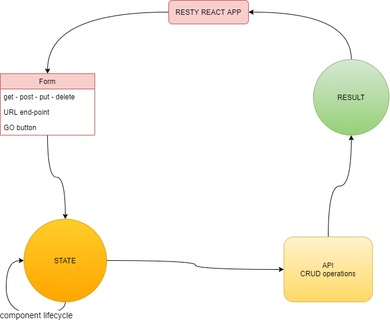

# resty

---
[Pull Request 1](https://github.com/ibrahemomari/resty/pull/1)

[Pull Request 2](https://github.com/ibrahemomari/resty/pull/2)

[Pull Request 3](https://github.com/ibrahemomari/resty/pull/3)

---

[CodeSandbox phase 1](https://codesandbox.io/s/funny-night-fbexd?file=/src/App.js)

[CodeSandbox phase 2](https://codesandbox.io/s/flamboyant-taussig-puip2)

[CodeSandbox phase 3](https://z4jxc.csb.app/)

---
Install Dependences
===
>npm install

---
Run:
===
>npm start
---
UML
==

